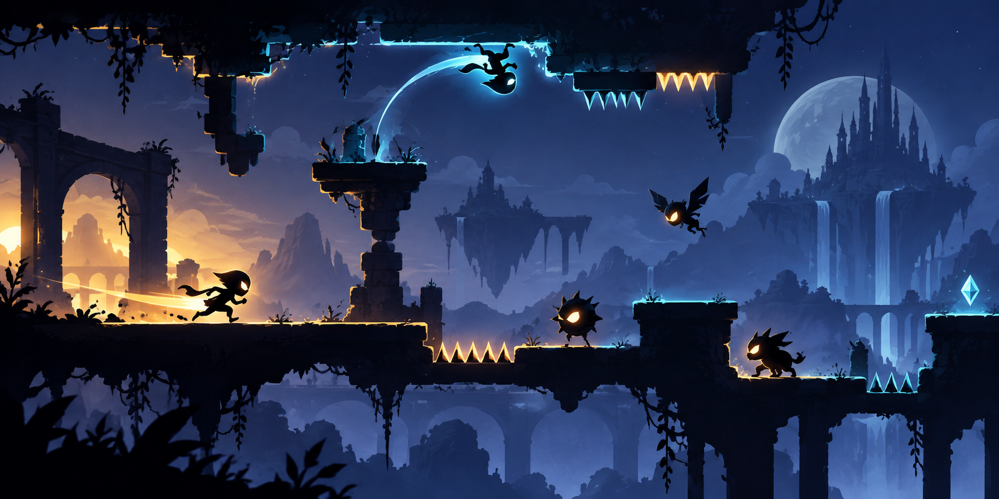

# SOFTCOM Project — One-Button Game

**First place, Game Development — GIKI SOFTCOM 2026.** Built as a team project for a one-button game theme.

*Original concept artwork based on the game's mechanics; not a gameplay screenshot.*

This Unity 2D runner turns one input into three actions. The player moves through scrolling level chunks, attacks enemies, flips gravity to switch routes, and tries to stay alive as the pace increases.

## Controls

Use **Space** or the **left mouse button**:

| Input | Action |
|---|---|
| Tap | Light attack |
| Hold, then release | Charged attack |
| Double-tap | Flip gravity |

## How it works

- `InputManager` distinguishes taps, holds, and double-taps, then sends events to the player controller.
- `PlayerController` handles movement, attacks, gravity inversion, and health.
- `LevelManager` spawns level chunks ahead of the player and removes chunks left behind. It allows more difficult chunks as play continues.
- Enemy types differ in speed, health, and resistance to light attacks. The HUD shows health, score, and charge progress.

## Open the project

Open the repository folder in Unity Hub with **Unity 6000.0.62f1**. Load `Assets/Scenes/GameScene.unity` and press Play. The project uses the Input System and Universal Render Pipeline packages listed in `Packages/manifest.json`.

The repository also contains licensed third-party art assets. The banner above is separate concept artwork created for this README.
